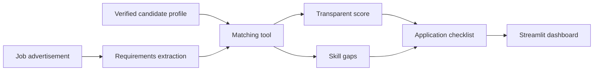

# JobMatch Agent

A tool-calling AI agent that compares job advertisements with a verified candidate profile, calculates an evidence-based match score, identifies skill gaps, and creates an application checklist.

The project is designed for students who want structured support when deciding which jobs fit their current experience.

## Key features

- Extracts structured requirements from unstructured job advertisements
- Loads a verified candidate profile with evidence for each skill
- Calculates a deterministic and transparent match score
- Separates required skill gaps from preferred skill gaps
- Generates an honest, prioritized application checklist
- Supports follow-up questions with conversation memory
- Compares and ranks multiple job opportunities
- Shows which tools the agent selected and called
- Uses strict structured output to prevent malformed AI responses
- Includes automated tests for scoring, tools, profile validation, error handling, agent behavior, and result parsing

## How it works



The language model coordinates the workflow, but it does not decide the score itself. Scoring is performed by deterministic Python logic so the result is reproducible and explainable.

## Agent tools

| Tool | Purpose |
|---|---|
| `get_candidate_profile` | Loads the verified profile and skill evidence |
| `extract_requirements` | Extracts structured requirements from a job advertisement |
| `calculate_job_match` | Calculates the deterministic match score |
| `create_application_checklist` | Produces evidence-based application actions |

## Technology stack

- Python 3.11
- Groq API
- GPT-OSS 20B
- LangChain
- LangGraph
- Pydantic
- Streamlit
- pytest

## Project structure

```text
jobmatch-agent/
├── app/
│   ├── agent.py
│   ├── dashboard.py
│   ├── errors.py
│   ├── extractor.py
│   ├── profile.py
│   ├── result_parser.py
│   ├── schemas.py
│   ├── scoring.py
│   └── tools.py
├── data/
│   └── candidate_profile.json
├── scripts/
├── tests/
├── .env.example
├── .gitignore
└── requirements.txt
```

## Local setup

### 1. Clone the repository

```bash
git clone https://github.com/ZhanetaGasparyan/jobmatch-agent.git
cd jobmatch-agent
```

### 2. Create a virtual environment

```bash
python3.11 -m venv .venv
source .venv/bin/activate
```

### 3. Install dependencies

```bash
python -m pip install -r requirements.txt
```

### 4. Configure the API key

Copy the example environment file:

```bash
cp .env.example .env
```

Add your private Groq API key to `.env`:

```text
GROQ_API_KEY=your_groq_api_key_here
```

Never commit `.env` or expose an API key publicly.

### 5. Run the tests

```bash
python -m pytest -v
```

Current test suite: **16 passing tests**.

### 6. Start the application

```bash
python -m streamlit run app/dashboard.py
```

Open the local address displayed in the terminal.

## Match scoring

The score is calculated using deterministic Python logic:

- Required skills contribute 80% of the score
- Preferred skills contribute 20% of the score
- Skill aliases are normalized before matching
- Unknown skills are never invented
- Missing skills remain visible in the final result

Recommendation levels:

| Score | Recommendation |
|---|---|
| 75–100 | Strong match |
| 50–74 | Possible match |
| 0–49 | Needs development |

The score supports decision-making only. It does not predict whether an applicant will be interviewed or hired.

## Conversation memory

The agent uses a LangGraph in-memory checkpointer and a unique conversation ID. Users can ask follow-up questions about the analyzed job while preserving the context of the current conversation.

Starting a new conversation clears that context but keeps the temporary comparison board.

## Privacy and responsible use

- Job advertisements are sent to the configured Groq model for analysis.
- The verified candidate profile is used as context during the agent workflow.
- The application does not submit job applications automatically.
- The system is instructed not to invent experience or recommend dishonest claims.
- API keys are stored locally and excluded from Git.
- Users should avoid adding private contact details to public profile files.

## Current limitations

- The included profile is configured for one candidate.
- The comparison board is stored only in the current Streamlit session.
- Job requirement extraction depends on an external language-model API.
- Match scores represent skill alignment, not hiring probability.
- The application does not currently parse uploaded CV files.

## Future improvements

- Editable candidate profiles
- CV upload and structured extraction
- Persistent job comparison history
- Exportable analysis reports
- Additional tests for external API boundaries
- Public deployment with protected secrets

## Author

**Zhaneta Gasparyan**

Computer Science student at TU Darmstadt.